<div align="center">

# 🛒 TechStore — E-Commerce de Tecnología

**Tienda en línea moderna para productos tecnológicos de alta gama.**  
Diseñada con un enfoque oscuro, elegante y totalmente responsiva.

[](https://nextjs.org/)
[](https://www.typescriptlang.org/)
[](https://tailwindcss.com/)
[](https://react.dev/)

</div>

---

<!-- 
  📸 IMAGEN RECOMENDADA — Portada principal
  Archivo sugerido: assets/screenshots/hero.png
  Qué debe mostrar: La página principal completa con el hero section,
  el titular "Next-level tech. Delivered." y la imagen del laptop destacado.
  Toma la captura en pantalla completa (1440px de ancho).
-->

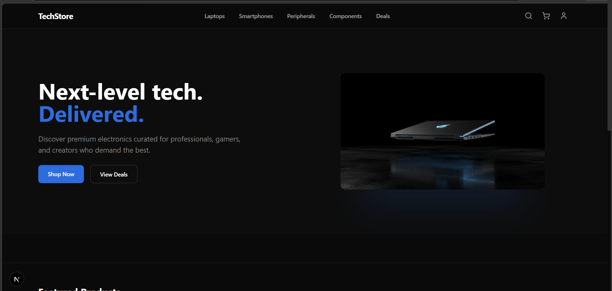
> *Vista de la página principal — sección hero con llamada a la acción.*

---

## 📋 Descripción

**TechStore** es una aplicación web de comercio electrónico especializada en electrónica premium: laptops, smartphones, audífonos, periféricos, accesorios gaming y más. El proyecto incluye autenticación completa, carrito persistente, catálogo con filtros avanzados, checkout con integración de PayPal y un panel de administración para gestión de productos.

La interfaz utiliza un diseño oscuro moderno con acento azul, optimizado para una experiencia premium tanto en escritorio como en dispositivos móviles.

---

## ✨ Características principales

| Funcionalidad | Descripción |
|---|---|
| 🏠 **Página de inicio** | Hero animado, tiras de categorías, secciones de productos destacados, nuevas llegadas y mejores ofertas |
| 🗂️ **Catálogo con filtros** | Filtra por categoría, precio, marca y puntuación; ordenamiento múltiple y paginación |
| 🔍 **Búsqueda global** | Modal de búsqueda con resultados instantáneos desde la navbar |
| 📦 **Detalle de producto** | Especificaciones técnicas, variantes de color/tamaño, galería y botón de carrito |
| 🛒 **Carrito tipo drawer** | Panel lateral con manejo de cantidad, subtotal en tiempo real y acceso directo al checkout |
| 💳 **Checkout multi-paso** | Flujo: envío → pago → confirmación, integrado con PayPal SDK |
| 👤 **Cuenta de usuario** | Perfil, historial de órdenes, lista de deseos, direcciones y configuración |
| 🔐 **Autenticación** | Modal de login y registro con validación de formulario |
| 🛠️ **Panel de administrador** | Crear, editar y eliminar productos desde el catálogo (rol admin) |
| 📱 **Diseño responsivo** | Experiencia adaptada para móvil, tablet y escritorio |

---

## 🖼️ Capturas de pantalla

### Página principal

<!-- 
  📸 IMAGEN RECOMENDADA — Hero Section
  Archivo: assets/screenshots/home-hero.png
  Qué capturar: La parte superior de la página de inicio, con el texto
  "Next-level tech. Delivered." y los botones "Shop Now" / "View Deals".
  Resolución sugerida: 1440 x 800px.
-->


---

### Catálogo de productos

<!-- 
  📸 IMAGEN RECOMENDADA — Catálogo
  Archivo: assets/screenshots/catalog.png
  Qué capturar: La página /catalog mostrando el sidebar de filtros a la izquierda
  (categoría, precio, marca, rating) y la grilla de productos a la derecha.
  Asegúrate de que se vean al menos 6 tarjetas de producto.
-->

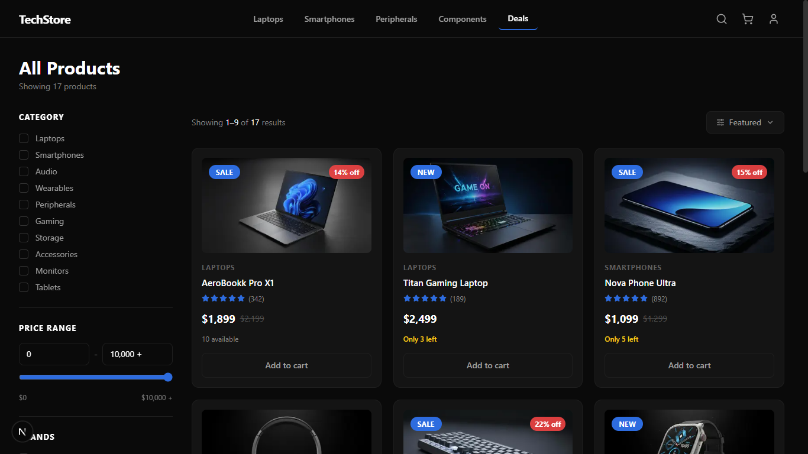

---

### Detalle del producto

<!-- 
  📸 IMAGEN RECOMENDADA — Detalle de producto
  Archivo: assets/screenshots/product-detail.png
  Qué capturar: La página /product/[id] de cualquier producto, mostrando
  la imagen grande, el precio, las especificaciones técnicas y el selector
  de variantes (color/tamaño).
-->

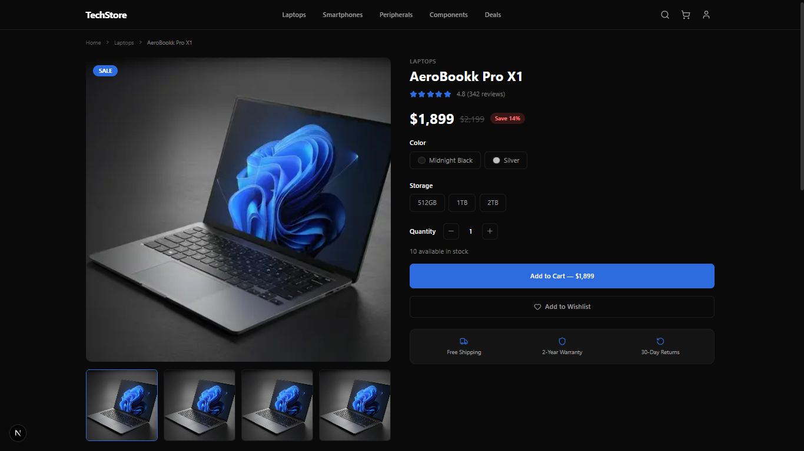

---

### Carrito de compras

<!-- 
  📸 IMAGEN RECOMENDADA — Carrito (drawer lateral)
  Archivo: assets/screenshots/cart-drawer.png
  Qué capturar: El drawer del carrito abierto desde la derecha de la pantalla,
  con al menos 2 productos, subtotal visible y el botón "Checkout".
-->

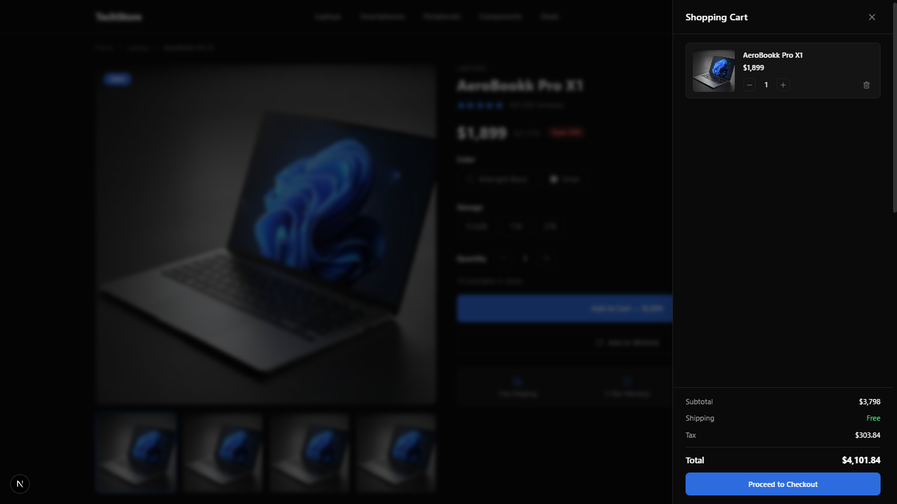

---
### Checkout. Paso 1: Ingreso de datos

<!-- 
  
-->

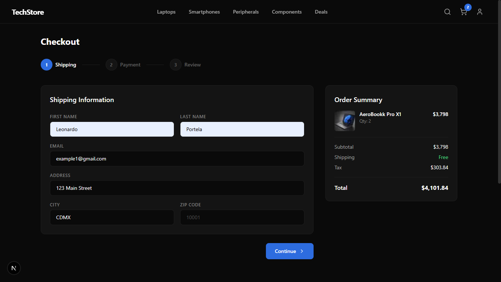

---

### Checkout. Paso 2: Seleccion metodo de pago

<!-- 

-->

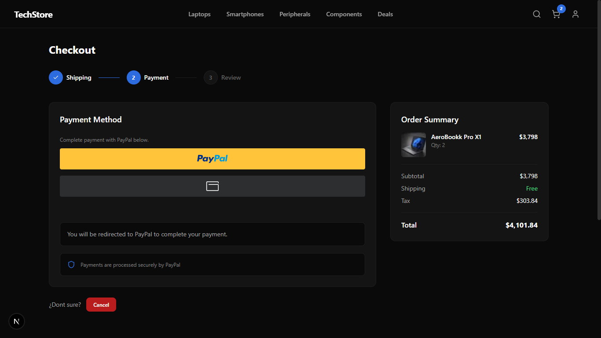

---

### Checkout. Paso 2.1: Generacion de orden de pago

<!-- 

-->

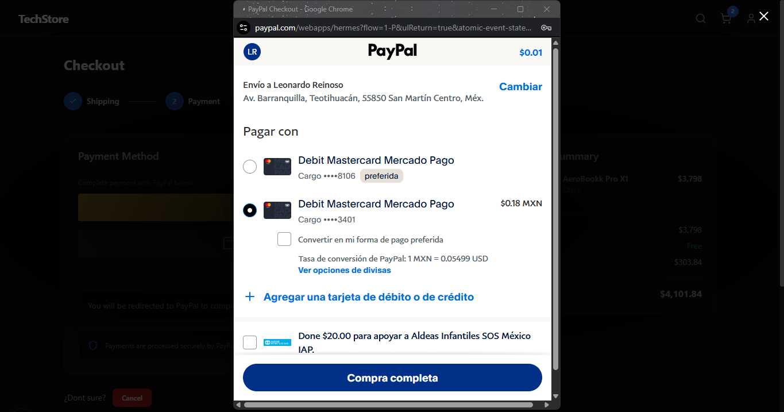

---

### Checkout. Paso 3: Pago exitoso

<!-- 

-->

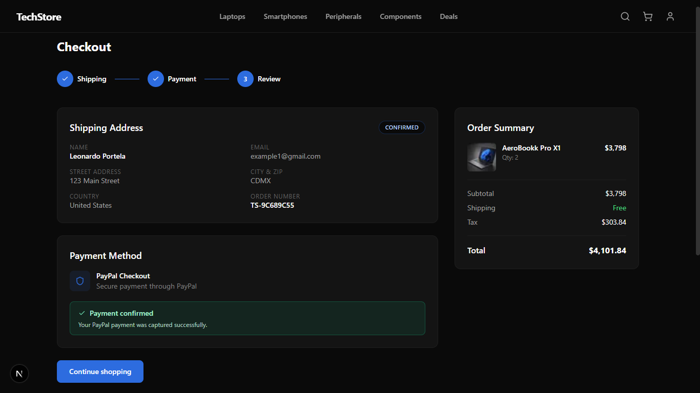

---

### Checkout. Paso 3.1: Mail de pago exitoso

<!-- 

-->

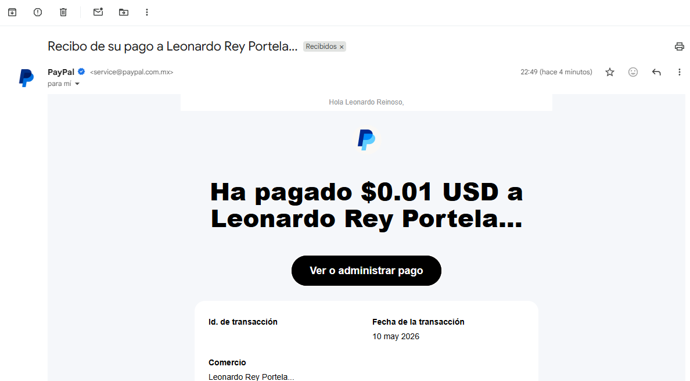

---

### Login / Registro

<!-- 
  📸 IMAGEN RECOMENDADA — Modal de autenticación
  Archivo: assets/screenshots/auth-modal.png
  Qué capturar: El modal de login/registro abierto sobre la pantalla,
  con los campos de email, contraseña y el botón de acción. Puedes mostrar
  el formulario de "Sign In" o el de "Create Account".
-->

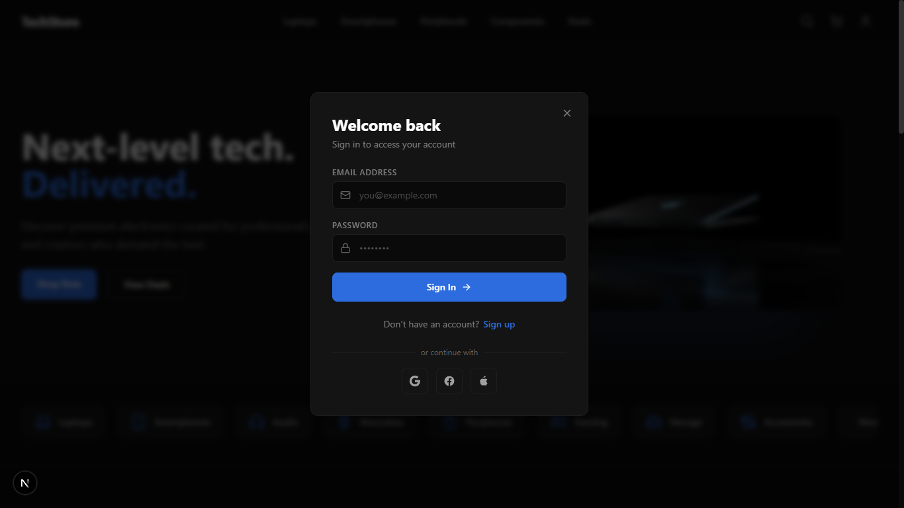

---

### Panel de cuenta

<!-- 
  📸 IMAGEN RECOMENDADA — Página de cuenta
  Archivo: assets/screenshots/account.png
  Qué capturar: La página /account con las pestañas de navegación lateral
  (Profile, Orders, Wishlist, Addresses, Settings) y el contenido del perfil
  del usuario visible.
-->

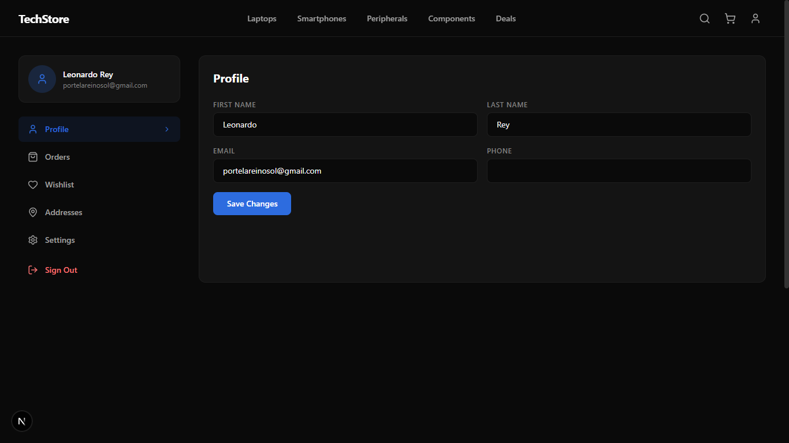

---

### Vista en movil

<!-- 
  📸 IMAGEN RECOMENDADA — Responsive / Móvil
  Archivo: assets/screenshots/mobile.png
  Qué capturar: La página principal o el catálogo vistos desde un viewport
  de 375px (iPhone). Puedes usar DevTools de Chrome (F12 → modo responsivo).
  Muestra la navbar y las tarjetas de producto en columna única.
-->

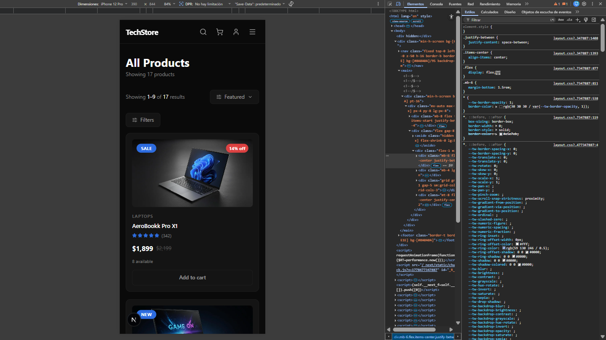

---

### Video de funcionamiento

[Ver video en Google Drive](https://drive.google.com/file/d/15rEa0CX8h07SEpbI9q9bGe_jJ3HWV0Kt/view?usp=sharing)

---

## 🧰 Tecnologías utilizadas

### Frontend
- **[Next.js 15](https://nextjs.org/)** — Framework React con App Router y Server Components
- **[React 19](https://react.dev/)** — Biblioteca principal de UI
- **[TypeScript 5.9](https://www.typescriptlang.org/)** — Tipado estático
- **[Tailwind CSS 3.4](https://tailwindcss.com/)** — Estilos utilitarios

### UI & Componentes
- **[Radix UI](https://www.radix-ui.com/)** — Primitivas de componentes accesibles (Dialog, Drawer, Tabs, Select, etc.)
- **[Lucide React](https://lucide.dev/)** — Iconografía
- **[Recharts](https://recharts.org/)** — Gráficos y visualizaciones
- **[Sonner](https://sonner.emilkowal.ski/)** — Notificaciones tipo toast
- **[Embla Carousel](https://www.embla-carousel.com/)** — Carouseles

### Formularios & Validación
- **[React Hook Form](https://react-hook-form.com/)** — Manejo de formularios
- **[Zod](https://zod.dev/)** — Validación de esquemas

### Pagos
- **[PayPal SDK](https://developer.paypal.com/)** — Procesamiento de pagos

---

## 🚀 Instalación

### Requisitos previos

- Node.js `v18` o superior
- npm, yarn o pnpm

### Pasos

**1. Clona el repositorio**
```bash
git clone https://github.com/tu-usuario/e-commersTecnology.git
cd e-commersTecnology
```

**2. Instala las dependencias**
```bash
npm install
```

**3. Configura las variables de entorno**

Crea un archivo `.env.local` en la raíz del proyecto:
```env
NEXT_PUBLIC_API_BASE_URL=http://localhost:8000/api
PAYPAL_CLIENT_ID=tu_paypal_client_id
```

**4. Inicia el servidor de desarrollo**
```bash
npm run dev
```

Abre [http://localhost:3000](http://localhost:3000) en tu navegador.

---

## 💻 Uso

### Scripts disponibles

| Comando | Descripción |
|---|---|
| `npm run dev` | Inicia el servidor en modo desarrollo |
| `npm run build` | Genera el build de producción |
| `npm run start` | Inicia el servidor de producción |
| `npm run lint` | Ejecuta el linter |

### Roles de usuario

| Rol | Acceso |
|---|---|
| **Visitante** | Navega el catálogo y productos |
| **Usuario registrado** | Carrito, checkout, cuenta, órdenes |
| **Administrador** | Todo lo anterior + crear/editar/eliminar productos |

---

## 📁 Estructura del proyecto

```
e-commersTecnology/
├── app/                        # Rutas de Next.js (App Router)
│   ├── page.tsx                # Página principal (/)
│   ├── catalog/                # Catálogo de productos (/catalog)
│   │   ├── page.tsx
│   │   ├── new/page.tsx        # Crear producto (admin)
│   │   └── edit/[id]/page.tsx  # Editar producto (admin)
│   ├── product/[id]/           # Detalle de producto
│   ├── checkout/page.tsx       # Proceso de pago
│   ├── account/page.tsx        # Panel del usuario
│   ├── confirmation/page.tsx   # Confirmación de orden
│   └── layout.tsx              # Layout raíz
│
├── src/
│   ├── components/             # Componentes reutilizables
│   │   ├── Navbar.tsx          # Barra de navegación
│   │   ├── Footer.tsx          # Pie de página
│   │   ├── ProductCard.tsx     # Tarjeta de producto
│   │   ├── CartDrawer.tsx      # Carrito lateral
│   │   ├── AuthModal.tsx       # Modal login/registro
│   │   ├── SearchModal.tsx     # Modal de búsqueda
│   │   └── ui/                 # Componentes UI base (Radix)
│   ├── context/
│   │   └── StoreContext.tsx    # Estado global (carrito, auth, etc.)
│   ├── data/
│   │   └── products.ts         # Datos estáticos de productos
│   ├── lib/
│   │   ├── api.ts              # Cliente HTTP para la API
│   │   └── utils.ts            # Utilidades generales
│   └── types/
│       └── index.ts            # Tipos TypeScript globales
│
├── public/                     # Imágenes y assets estáticos
├── assets/screenshots/         # Capturas para el README
└── package.json
```

---

## 👨‍💻 Créditos

Desarrollado como proyecto de la materia **Programación Web** — Semestre 6.

| Integrante | Rol |
|---|---|
| Alexis Vladimir Aldana Zamudio | Desarrollo frontend
| Clarissa Montufar Ravelo | Desarrollo de base de datos
| Marco Antonico Miranda Muñoz | Lider de proyecto
| Leonardo Rey Portela Reinoso | Desarollo backend | integración de pagos
| Luis Angel Peña Escamilla. | Desarrollo backend


---

---

<div align="center">

Hecho con ❤️ usando **Next.js** + **Tailwind CSS** + **React**

</div>
